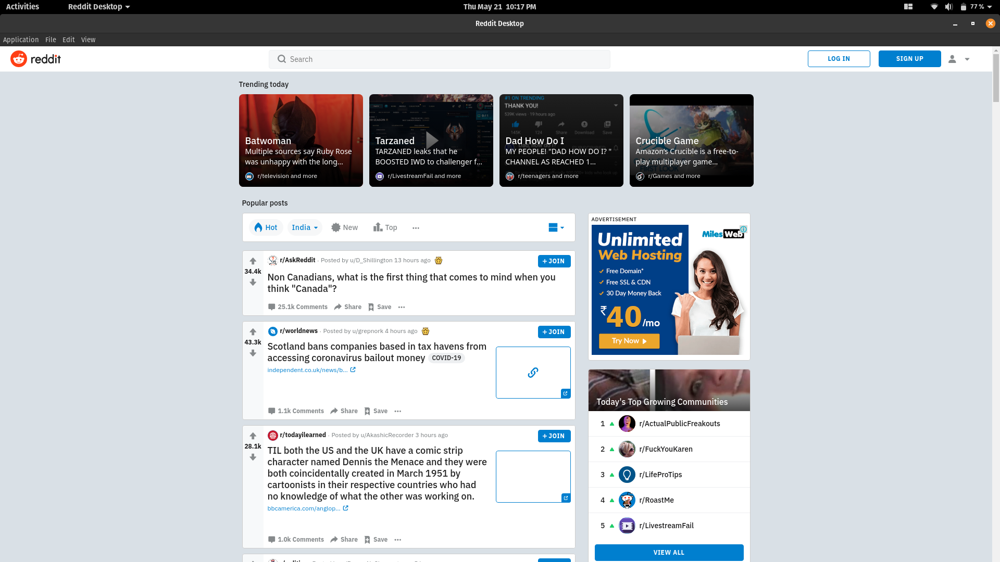
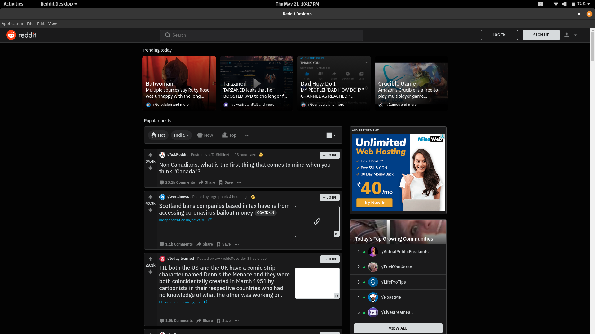

# Reddit-Desktop-App

<p align="center">
  
</p>

---

Reddit Desktop is a desktop wrapper for Reddit.com built with [ElectronJS](https://github.com/electron/electron). Give it a try, and if you like what you see, share it with your friends!

PS : Supports native dark mode :)


## 📀 Installation

Download the [latest releases](https://github.com/savannahar68/Reddit-Desktop-App/releases) (Releasing Soon) for **Windows**, **Linux**, or **MacOS**. Inside the zipped folder will be an executable that can be run.

- For MacOS, drag the app into `Applications` folder.

### 🎶 Versions

- v0.1.0 => Releasing soon...

## 📸 Action Shots






<p align="center">
  
</p>

## ✏️ Development

To build the app locally, clone the repository, install all dependencies, and run the available npm scripts.

```sh
git clone https://github.com/savannahar68/Reddit-Desktop-App/.git
cd Reddit-Desktop-App
yarn install
```

```sh
$ // To run locally
$ yarn start
$ // To build OS specific binaries 
$ yarn package-win
$ yarn package-lin
$ yarn package-mac
```

To build production ready applications for macos (dmg), windows (exe), and linux (sh), run `yarn package-all`.

🛎️ **Have suggestions?** Feel free to create an issue or make a pull request.

### Dependencies

- [about-window](https://ghub.io/about-window): &#39;About App&#39; window for Electron application
- [electron-localshortcut](https://ghub.io/electron-localshortcut): register/unregister a keyboard shortcut locally to a BrowserWindow instance, without using a Menu
- [electron-window-state](https://ghub.io/electron-window-state): Simple module that helps to save and restore size and position of Electron windows.
- [file-system](https://ghub.io/file-system): Strengthen the ability of file system

### Dev Dependencies

- [cross-env](https://ghub.io/cross-env): Run scripts that set and use environment variables across platforms
- [del](https://ghub.io/del): Delete files and directories
- [electron](https://ghub.io/electron): Build cross platform desktop apps with JavaScript, HTML, and CSS
- [electron-packager](https://ghub.io/electron-packager): Customize and package your Electron app with OS-specific bundles (.app, .exe, etc.) via JS or CLI

## 📜 MIT License

_Disclaimer: Not affiliated with Reddit._
